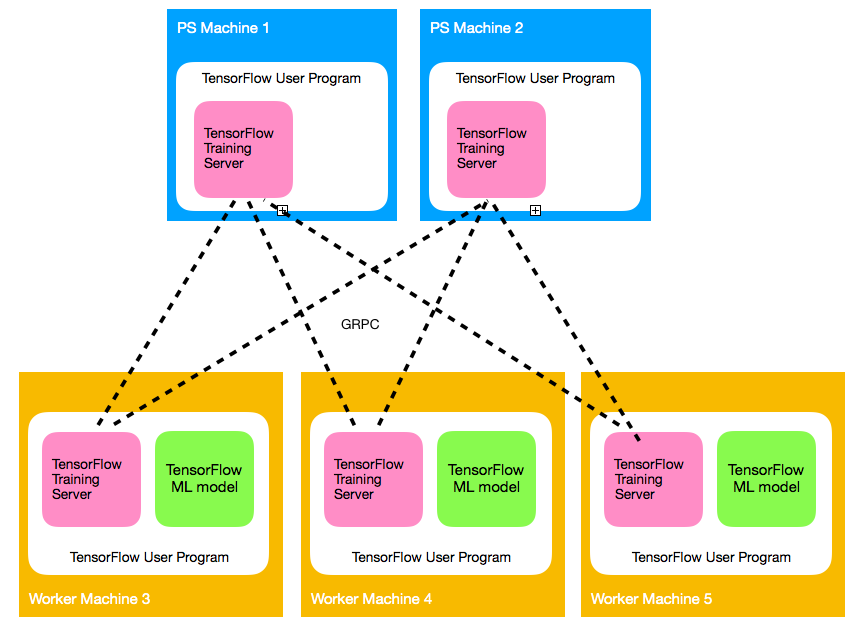
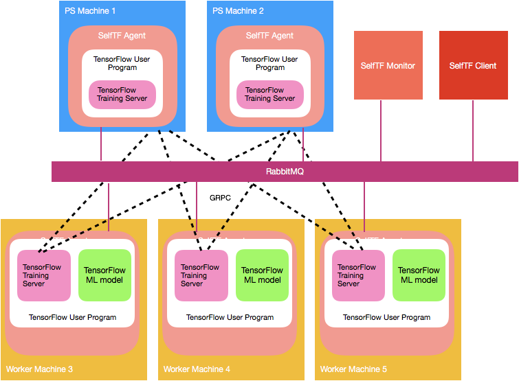

SelfTF is a auto-tuning Machine Learning Framework base on TensorFlow
# TensorFlow Arch


# SelftTF Arch

- SelfTF Client, provide a cmd interface for user to submit their machine learning job
- SelfTF Agent, a daemon process to control the user programs within a single machine
- SelfTF Monitor, a daemon process to coordinate the SelfTF Agent in different machines. All tuning process is done by this daemon
# Important source code
1. selftf/monitor.py
    - Main program of SelfTF Monitor
2. selftf/agent.py
    - Main program of SelfTF agent
3. selftf/client.py
    - Main program of SelfTF client
4. selftf/lib/tuner.py
    - All source code related to tuning process
        - Predict remaining runtime
            - def bo_fun
        - BO
            - class GPTrainingModel

# Cluster List

Cluster Name| Master node hostname | slaves node hostname
--- | --- | ---
ssd | ssd02 | ssd07-ssd42
b1g1 | b1g1 | b1g1-b1g36
b1b37 | b1g37 | b1g37-b1g72


<!-- ### Install Directory: `/root/pstuner` -->
# Start pstuner with baseline mode (configuration is entered by user, no reconfiguration occur)
1. ssh to master node (e.g ssd02)
2. open a tmux
3. run command "sh /root/pstuner/bin/run_cnn_single_config.sh"
4. You may change the content in "/root/pstuner/bin/run_cnn_single_config.sh" to change differnet configuration.
# To start pstuner and execute job ( pre defined script version)
1. ssh to master node (e.g ssd02)
1. open a tmux
2. change content /root/pstuner/selftf/test_os_parameter.py to schedule the ML Job
3. run command "/root/pstuner/bin/run_selftf_benchmark.sh"

# Important log files
1. /root/pstuner/monitor.out
    - SelfTF monitor main
2. /root/pstuner/log/......
3. /root/pstuner/agent.out

# Import keywords for monitor.out
1.


# To resize the cluster
1. ssh to ssh02
2. `cd /root/pstimer`

3a. To start PSTuner in ssd03 ssd04 ssd05 only, execute `ln -sfn /root/pstuner/slaves_3 /root/pstuner/slaves`

3b. To start PSTuner in ssd03-ssd42, execute `ln -sfn /root/pstuner/slaves_all /root/pstuner/slaves`

# To start pstuner and execute program
1. ssh to ssh02
2. execute `tmux`
3. execute `sh /root/pstuner/bin/start_monitor.sh` , it will keep on output log
4. Open another windows in tmux
5. execute `sh /root/pstuner/bin/start_all_agent.sh`
6. In the windows of start_monitor.sh, you can see some log like
        DEBUG:Monitor:Receive msg from ssd05_2222 type: RegisterAgent
7. copy your TF program and data to each machine (ssd03 - ssd42) with same path
8. In ssd02, execute `python client.py --action submit_job --script /root/anaconda2/bin/python {tf program path}`
        e.g. python /root/pstuner/client.py --action submit_job --script /root/anaconda2/bin/python /root/pstuner/tf_minst2.py
   A job id is printed on the console
9. In the windows of start_monitor.sh, you can see
        INFO:queue:Send message from 'monitor' to 'ssd05_2222' type: StartProcess

# To get job statistic csv
1. `cd /root/pstimer`
2. With the job id that you got when u submitted the TF job, check the
folder in ssd02 `/root/pstuner/log/{job_id}`
3. CSV files is created after the ML job done

# TF program modification need
1. Please take a look `tf_minst2.py` in the source code root
2. A class, TFProgramUtil, is implemented (still in development), it provide API to get TF configuration. For exampling, getting ConfigProto in method get_tf_config_proto() to change configurations inter_op_parallelism_threads and intra_op_parallelism_threads

# Known issue:
1. Sometimes, TF Parameter Server can not be killed.

# ImportI have install the pstuner on ssd02-ssd042 on `/root/pstuner`

PSTuner is master-slave arch

# To resize the cluster
1. ssh to ssh02
2. `cd /root/pstimer`

3a. To start PSTuner in ssd03 ssd04 ssd05 only, execute `ln -sfn /root/pstuner/slaves_3 /root/pstuner/slaves`

3b. To start PSTuner in ssd03-ssd42, execute `ln -sfn /root/pstuner/slaves_all /root/pstuner/slaves`

# To start pstuner and execute program ( generic version )
1. ssh to ssh02
2. execute `tmux`
3. execute `sh /root/pstuner/bin/start_monitor.sh` , it will keep on output log
4. Open another windows in tmux
5. execute `sh /root/pstuner/bin/start_all_agent.sh`
6. In the windows of start_monitor.sh, you can see some log like
        DEBUG:Monitor:Receive msg from ssd05_2222 type: RegisterAgent
7. copy your TF program and data to each machine (ssd03 - ssd42) with same path
8. In ssd02, execute `python client.py --action submit_job --script /root/anaconda2/bin/python {tf program path}`
        e.g. python /root/pstuner/client.py --action submit_job --script /root/anaconda2/bin/python /root/pstuner/tf_minst2.py
   A job id is printed on the console
9. In the windows of start_monitor.sh, you can see
        INFO:queue:Send message from 'monitor' to 'ssd05_2222' type: StartProcess

# To get job statistic csv
1. `cd /root/pstimer`
2. With the job id that you got when u submitted the TF job,  execute command
    `python /root/pstuner/client.py --action get_job {job_id_u_want}`
3. A CSV file will be created in /root/pstuner

# TF program modification need
1. Please take a look `tf_minst2.py` in the source code root
2. A class, TFProgramUtil, is implemented (still in development), it provide API to get TF configuration. For exampling, getting ConfigProto in method get_tf_config_proto() to change configurations inter_op_parallelism_threads and intra_op_parallelism_threads

# Known issue:
1. Sometimes, TF Parameter Server can not be killed.

# Important Configuration

# Useful command

# Replace the fit function
1. vi /root/pstuner/tuner.sh
2. search "func_idx=0" and you cna see a line "def __init__(self, tf_config_util, epsilon=0.5, func_idx=0):"
3. if func_idx = 0 .... use old method
4. if func_idx = 1 .... use bo method
SVM
```
export KEY_ESTIMATION_FUNC="bo";export ONLINE_NUM_ITER_PER_OS=500;export ONLINE_OS_SIZE=100;export OS_SIZE=20;export NUM_ITER_PER_OS=60;cd /root/pstuner && sh bin/stop_monitor.sh && sh bin/stop_all_agent.sh && sleep 2 && bin/start_monitor.sh && sh bin/start_all_agent.sh && sleep 2 && python client.py --action submit_job --ml_model SVM --batch_size 2000 --learning_rate 0.001 --target_loss 0.07 --script /root/anaconda2/bin/python /root/pstuner/disML_Framwork.py --ML_model=SVM --num_Features=3231961
```
CNN:
```
export KEY_ESTIMATION_FUNC="bo";export ONLINE_NUM_ITER_PER_OS=500;export ONLINE_OS_SIZE=100;export OS_SIZE=20;export NUM_ITER_PER_OS=60;cd /root/pstuner && sh bin/stop_monitor.sh && sh bin/stop_all_agent.sh && sleep 2 && bin/start_monitor.sh && sh bin/start_all_agent.sh && sleep 2 && python client.py --action submit_job --ml_model CNN --batch_size 100 --learning_rate 0.0001 --target_loss 0.5 --script /root/anaconda2/bin/python /root/pstuner/disCNN_cifar10.py
```

Useful script:
Sync

```
cat slaves | xargs -i -P72 rsync -avz /root/anaconda2/lib/python2.7/site-packages/tensorflow/python/training/supervisor.py {}:/root/anaconda2/lib/python2.7/site-packages/tensorflow/python/training/
```


# Deploy custom tensorFlow
```
bazel build --config=opt //tensorflow/tools/pip_package:build_pip_package
```
```
bazel-bin/tensorflow/tools/pip_package/build_pip_package /tmp/tensorflow_pkg
```

# SELFTF gnuplot loss from log
```
ssh ssd02 cat /root/pstuner/monitor.out | grep "Collected iteration statistic"  |sed -n 's/.*loss:\(.*\)/\1/p' | gnuplot -p -e 'plot "/dev/stdin" using 0:1 with lines'
```

# SELFTF gnuplot single node graph
```
ssh ssd36 cat pstuner/agent.out | grep last_cost: | tail -n +2 | sed -n 's/.*last_cost:\([0-9].[0-9]*\).*/\1/p' | gnuplot -p -e 'plot "/dev/stdin" using 0:1 with lines'
```

# gnutplot baseline experiment
```
ssh b1g1 cat /root/ex_result/baseline/cnn/CNN_34_14_Adam_0.0001_200_122_process.csv |awk -F',' '{print $4}' | gnuplot -p -e 'plot "/dev/stdin" using 0:1 with lines'
```

# Grep the best config obtained in online tuning phase
```
ssh ssd02 cat pstuner/monitor.out | grep "Best training conf"
```

# Grep the config SelfTF reconfiged in online tuning phase
```
ssh ssd02 cat pstuner/monitor.out | grep "We got a new config"
```

# Grep the
# Useful link
Source code reading for TensorFlow


https://zhuanlan.zhihu.com/p/26031658
